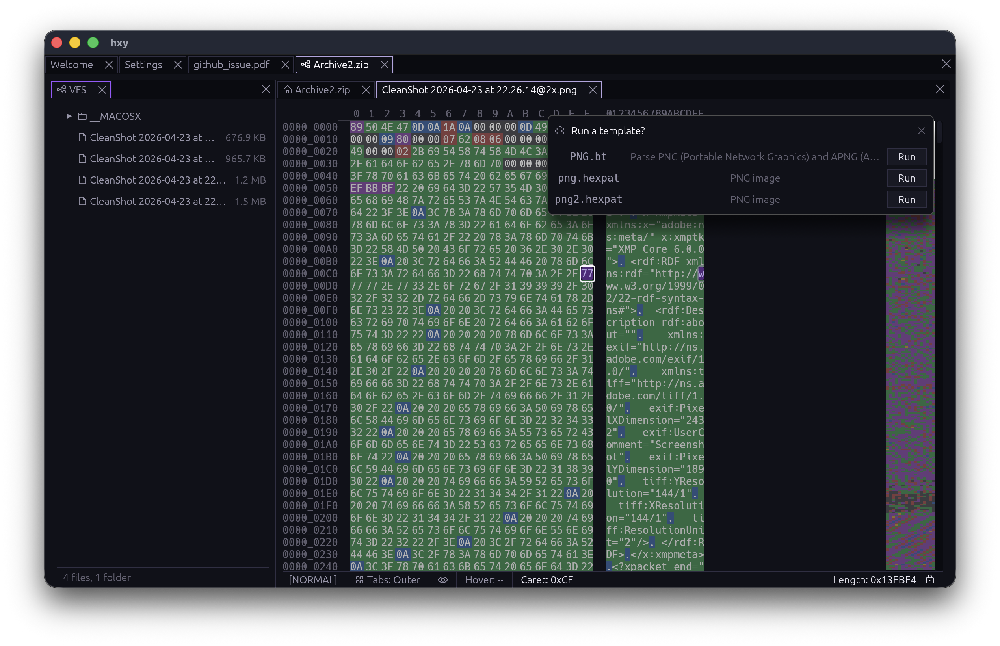
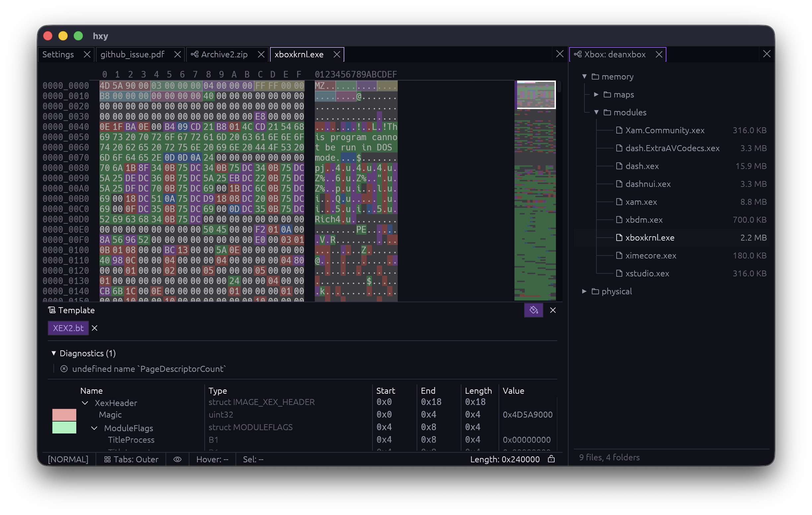
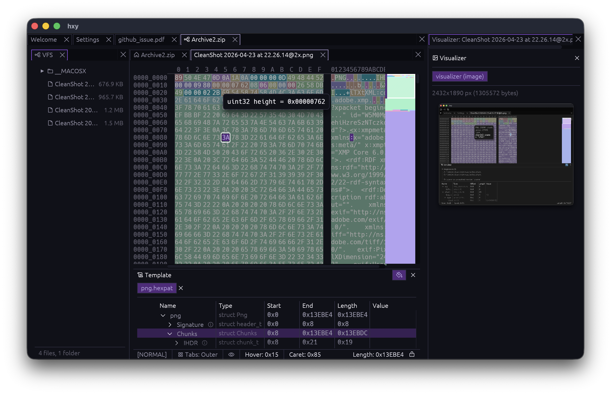
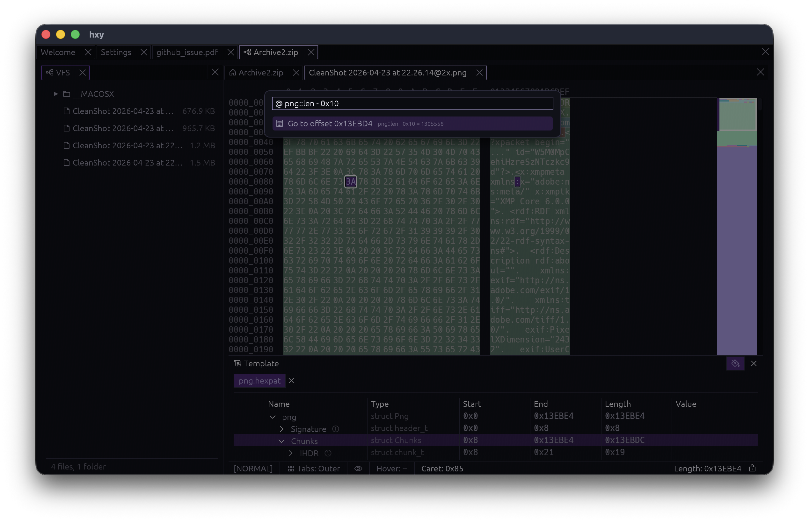
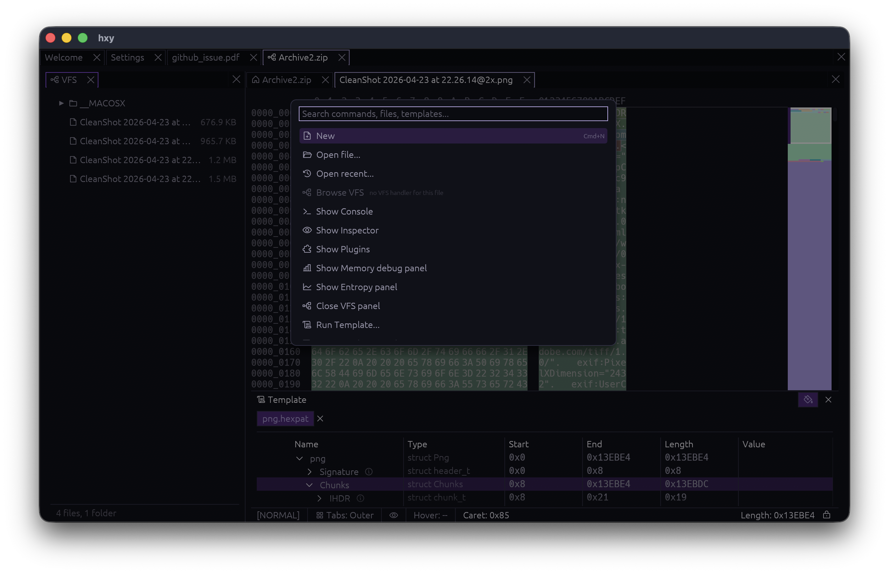

# hxy

A hex editor built with Rust and [egui]. Desktop and web.

Reusable egui widget: [](https://crates.io/crates/hxy-view) [](https://docs.rs/hxy-view)

## Screenshots

VFS browser (zip):



VFS browser (Xbox):



Loading a PNG from inside a zip:



Expression calculator:



Command palette:



## Install

```
cargo install hxy
```

## What's in the box

- File-backed hex view with selection, keyboard nav, drag-select, minimap
- Data inspector (integer widths, LEB128, float, time fields, RGBA/ARGB)
- 010 Editor Binary Template runtime (built in) -- or bring your own via WASM. 010 runtime does not have feature-parity, but can run some basic templates.
- ImHex pattern support
- VFS browser for archive formats (zip, etc.)
- IPC to open files from CLI in the existing window

## Status

too early to say.

Future plans:

- Refined plugin interface (it's day 1 and it's already a mess)
- Proper app bundling
- OS shell registration

## Goals

- Get to a good point so I can stop paying for a 010 Editor license
- Add process memory reading / raw disk reading
- Get working in web out of the box (not tested yet)
- Most components usable in library form so that people who need a hex view in an application can have one easily

## License

Dual-licensed under [MIT](LICENSE-MIT) or [Apache-2.0](LICENSE-APACHE), at your option.

[egui]: https://github.com/emilk/egui
